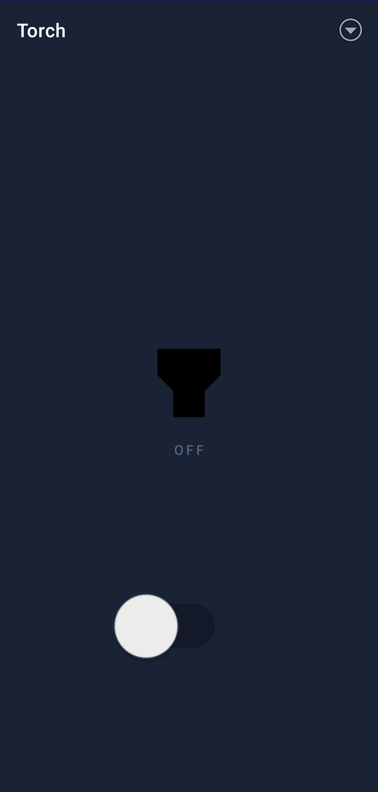
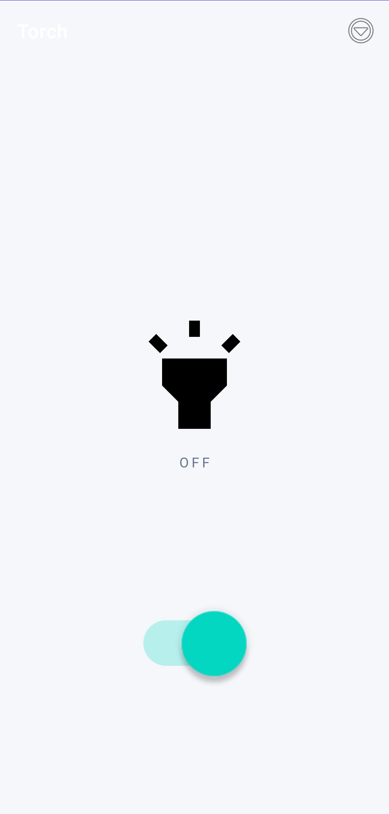

# 🔦 Torch — Android Flashlight App

> Application Android de lampe torche développée en **Java**, utilisant la **Camera2 API** pour le contrôle du flash.

---

## ✨ Fonctionnalités

- Allumer / éteindre la lampe torche via un **Switch**
- Changement dynamique du **fond d'écran** selon l'état (ON / OFF)
- Changement d'**icône** en temps réel
- Extinction automatique lors de la **mise en pause** de l'application

---

## 📸 Aperçu de l’application

| OFF | ON |
|:-:|:-:|
|  |  |

---


## 🏗️ Architecture

```
mg.carlos.torch/
├── MainActivity.java          # Logique principale (UI + contrôle torch)
└── res/
    ├── layout/
    │   └── activity_main.xml
    ├── drawable/
    │   ├── ic_torch_on.xml
    │   └── ic_torch_off.xml
    ├── menu/
    │   └── menu_main.xml
    └── values/
        └── colors.xml
```

---

## 📷 Camera2 API

**Permission requise** (`AndroidManifest.xml`) :

```xml
<uses-permission android:name="android.permission.CAMERA"/>
```

**Activation / désactivation du flash** :

```java
// Allumer
cameraManager.setTorchMode(cameraId, true);

// Éteindre
cameraManager.setTorchMode(cameraId, false);
```

---

## 🛠️ Stack technique

| Technologie       | Usage                    |
|-------------------|--------------------------|
| Java              | Langage principal        |
| Android SDK 23+   | Développement mobile     |
| Camera2 API       | Contrôle du flash        |
| ConstraintLayout  | Mise en page             |
| Vector Drawable   | Icônes torch             |

---

## 🚀 Installation

**Prérequis :**
- Android Studio Chipmunk ou supérieur
- Java 11+
- Android SDK 23 minimum (android version 6)
- Appareil avec flash caméra

**Étapes :**

```bash
git clone https://github.com/razanakoto-carlos/flashlight-android
```

1. Ouvrir le projet dans Android Studio
2. Synchroniser Gradle
3. Lancer sur un appareil réel ou émulateur

---

## 🧠 Concepts clés abordés

- Cycle de vie Android (`onPause`)
- Accès au hardware (flash caméra via `CameraManager`)
- Séparation UI / logique (`torchOn()`, `torchOff()`)

---
## 📦 Télécharger l'APK

> Testé sur Android 6.0+ (API 23)

[](https://github.com/razanakoto-carlos/flashlight-android/releases/download/1.0.0/Torch.apk)

---

## 👨‍💻 Auteur

**Carlos** — Développeur  
*Projet d'apprentissage : Java · Android Studio · Camera2 API*